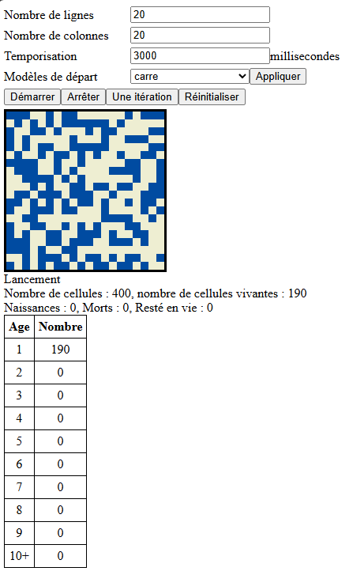

# Le jeu de la vie

## Introduction
Je ne ferais pas l'affront à qui que ce soit d'expliquer ce jeu connu de tout développeur qui se respecte. Le but de ce programme n'était pas de développer une nième version de celui-ci, mais d'apprendre un nouveau langage : le JavaScript. J'ai longtemps résisté à l'utilisation de ce langage, jusqu'au jour où je me suis rendu compte, à mon grand étonnement, que pour le développement front-end associé au CSS on peut réaliser des choses sympathiques.

Ayant pratiqué plusieurs langages, il me fallait me familiariser avec JavaScript. Habituellement on lit un ou deux livres, on suit des tutos sur YouTube, on fait des recherches sur Google. Cette fois, j'ai utilisé une nouvelle approche : Copilot. Soyons clair, je n'ai pas demandé à Copilot d'écrire le programme : l'algorithmique reste ma (faible) création, mais je lui ai demandé comment, en JavaScript, on réalisait telle ou telle action. Je dois avouer que j'ai été agréablement surpris : j'ai vraiment eu l'impression d'avoir un assistant qui m'accompagnait dans l'apprentissage du langage. La courbe d'apprentissage est bien plus rapide qu'avec une simple recherche Google. J'ai l'impression d'être passé d'un moteur de recherche à un moteur de réponses. Je n'ai pas eu besoin d'aller lire un tuto YouTube ni de valider certains points sur Google. C'est, à mon sens, un changement fondamental dans l'assistance que l'on attend du web. Certes, parfois il faut reformuler la question ou demander un petit exemple, mais quand on est familier avec la programmation, notre cerveau complète parfaitement son travail ; j'estime que Copilot en fait au moins 85 %.

Le programme résultant n'est pas parfait : il y a beaucoup de choses à améliorer, notamment la gestion des variables et probablement d'autres points, mais il fonctionne correctement.

C'est une version classique, si ce n'est que j'ai ajouté la colorisation des cellules. À chaque itération, une cellule qui reste vivante change de couleur. Il y a 10 couleurs : au bout de 10 itérations, la cellule garde la même couleur (rouge, en l'occurrence).

Ceci est une première version opérationnelle. D'autres idées m'étant venues lors de la conception, je vais continuer mon apprentissage via Copilot pour apporter de nouvelles fonctionnalités à ce programme.

## Usage

Pour lancer le programme, double-cliquez sur le fichier `jdlv.html`.

Bien que l'utilisation soit très simple, voici quelques explications pour chacun des champs et boutons :

| Information | Description |
|:-|:-|
| Nombre de lignes | Hauteur du tableau en nombre de cellules (une cellule fait 10×10 px) |
| Nombre de colonnes | Largeur du tableau en nombre de cellules (une cellule fait 10×10 px) |
| Temporisation | Temps de pause entre chaque itération (en millisecondes) |
| Modèles de départ | Permet de choisir des modèles ayant des comportements spécifiques. Le bouton « Appliquer » insère le modèle sélectionné dans la grille |
| Démarrer | Lance le calcul en itération continue |
| Arrêter | Stoppe le calcul |
| Une itération | Permet de calculer une seule itération |
| Réinitialiser | Génère une nouvelle grille aléatoire |
| Statistiques | Un ensemble d'informations est donné sur l'itération en cours |

## Environnement de travail
* Développement avec Visual Studio Code
* Assistant Copilot
* Microsoft Edge (je n'ai pas testé le programme avec d'autres navigateurs)

*Didier LEPRETRE*