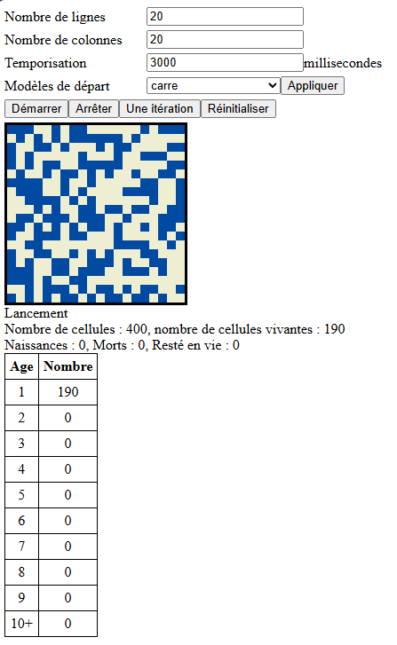

# Le jeu de la vie 

## Introduction
Je ne ferais pas l'affrond à qui que ce soit d'expliquer ce jeu connu de tout développeur qui se respecte. Le but de ce programme n'était pas de développer une n-ième version de celui mais d'apprendre un nouveau langage : Le Javascript. J'ai toujours freiné des deux pieds pour utiliser ce langage jusqu'au jour où je me suis rendu compte, à mon grand désespoir, que pour le développement front-end associé au css, on arrivait à faire des choses sympatiques.

Ayant pratiqué plusieurs langages, il fallait que je me familiarise avec le Javascript. Habituellement, on lit un ou deux livres, on suit des tutos sur Youtube, on fait des recherches dans Google. J'ai cette fois utilisé une nouvelle approche, utiliser CoPilot. Soyons clair, je n'ai pas demandé à Copilot d'écrire le programme, l'algoritmique reste ma (faible) création mais je lui ai demandé comment en Javascrit on réalisait telle ou telle action. Je dois avouer que j'ai été assez bluffé en ayant vraiment l'impression d'avoir un assistant qui m'accompagnait dans l'apprentissage du langage. La courbe de progression est bien plus rapide qu'avec Google. J'ai l'impression d'être passé d'un moteur de recherche à un moteur de réponse. Je n'ai pas eu besoin d'aller lire un tuto Youtube ou de valider certains points sur Google. C'est fondamentalement un grand changement dans l'assistance que l'on attend du web. Certes parfois, il faut reformuler la question, lui demander un petit exemple mais quand on est familier avec la programmation, notre cerveau complète parfaitement son travail dont j'estime qu'il en fait au moins 85%.

Certes le programme résultant n'est pas parfait, il y a beaucoup de choses à améliorer, notamment la gestion des variables et probablement d'autres points mais il fonctionne correctement.

C'est une version classique, si ce n'est que j'ai ajouté la colorisation des cellules. A chaque itération, une cellule qui reste vivante change de couleur, il y a 10 couleurs, donc au bout de 10 itérations la cellule garde la même couleur, rouge en l'occurence

Ceci est un première version opérationnelle mais d'autres idées m'étant venues lors de la conception, je vais continuer mon apprentissage via Copilot pour apporter de nouvelles fonctionnalités à ce programme.

## Usage

Pour lancer le programme double-cliquez sur le fichier jdlv.html

Bien que l'utilisation soit très simple voici quelques explications pour chacun des champs et boutons

| Information | Description |
|:-|:-|
| Nombre de lignes | Hauteur du tableau en nombre de cellules (une cellule fait 10x10 px) |
| Nombre de colonnes | Largeur du tableau en nombre de cellules (une cellule fait 10x10 px) |
| Temporisation | Temps de pause entre chaque itération (en millisecondes) |
| Modèles de départ | Permet de choisir des modèles ayant des comportements spécifiques. Le bouton appliquer pousse le modèle sélectionné dans la grille |
| Démarrer | Lance le calcul, itération en continu |
| Arrêter | Stoppe le calcul |
| Une itération | Permet de calculer qu'une seule itération |
| Réinitialiser | Génère une nouvelle grille aléatoire |
| Statistiques | Un ensemble d'informations sont données sur l'itération en cours |

## Environnement de travail
* Développement à l'aide Visual Studio Code
* Assistant Copilot
* Microsoft Edge ( je n'ai pas tester la programme avec d'autres navigateurs)

*Didier LEPRETRE*